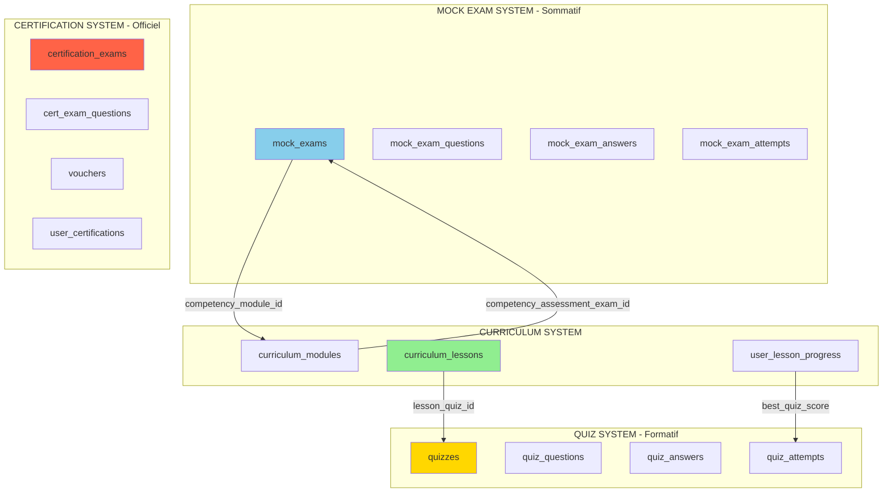

# 🎯 Analyse des 3 Systèmes de Quiz/Examens du Portail BDA

**Date**: 2025-10-20
**Statut**: ✅ Documentation des systèmes existants

---

## 📊 Vue d'Ensemble : Les 3 Systèmes

Le portail BDA a effectivement **3 systèmes distincts** de quiz/examens, chacun avec son propre objectif pédagogique :

```
┌─────────────────────────────────────────────────────────────────┐
│                    PORTAIL BDA - SYSTÈMES DE QUIZ               │
├─────────────────────────────────────────────────────────────────┤
│                                                                  │
│  1. QUIZ SYSTEM (table: quizzes)                                │
│     → Quiz de leçon (42 quiz)                                   │
│     → Formative assessment                                      │
│     → Pas de stockage permanent du score                        │
│     → Lié aux lessons via lesson_quiz_id                        │
│                                                                  │
│  2. MOCK EXAM SYSTEM (table: mock_exams)                        │
│     → Examens blancs d'entraînement                             │
│     → Summative assessment                                      │
│     → Stockage des tentatives et scores                         │
│     → 3 catégories: CP, SCP, General                            │
│     → Étendu pour: pre/post/competency assessments              │
│                                                                  │
│  3. CERTIFICATION EXAM SYSTEM (table: certification_exams)      │
│     → Examens officiels de certification                        │
│     → Nécessite un voucher                                      │
│     → Score enregistré dans user_certifications                 │
│     → Résultat officiel pour certification                      │
│                                                                  │
└─────────────────────────────────────────────────────────────────┘
```

---

## 🔍 Analyse Détaillée de Chaque Système

### 1️⃣ QUIZ SYSTEM (Quizzes) - Quiz de Leçons

**Table**: `quizzes`
**Créé dans**: `20251001000001_create_quiz_tables.sql`

#### Objectif
- **Évaluation formative** des leçons (42 sous-compétences)
- Validation de compréhension immédiate après lecture
- Permettre réapprentissage avant passage au niveau suivant

#### Caractéristiques
```sql
CREATE TABLE public.quizzes (
    id UUID PRIMARY KEY,
    title TEXT NOT NULL,
    title_ar TEXT,
    description TEXT,
    certification_type certification_type NOT NULL, -- CP ou SCP
    difficulty_level difficulty_level NOT NULL,
    time_limit_minutes INTEGER NOT NULL DEFAULT 60,
    passing_score_percentage INTEGER NOT NULL DEFAULT 70,
    is_active BOOLEAN NOT NULL DEFAULT true,
    ...
);
```

#### Utilisation dans le Système de Leçons
```sql
-- Lien depuis curriculum_lessons
CREATE TABLE public.curriculum_lessons (
    ...
    lesson_quiz_id UUID REFERENCES public.quizzes(id),
    quiz_required BOOLEAN NOT NULL DEFAULT true,
    quiz_passing_score INTEGER NOT NULL DEFAULT 70,
    ...
);
```

#### Tables Associées
- `quiz_questions` - Questions du quiz
- `quiz_answers` - Réponses possibles
- `quiz_attempts` - Tentatives des utilisateurs

#### Flux Utilisateur
```
User termine lecture leçon
  ↓
Status = 'quiz_pending'
  ↓
Accès au quiz via lesson_quiz_id
  ↓
Passe le quiz
  ↓
Score enregistré dans user_lesson_progress.best_quiz_score
  ↓
Si score >= passing_score → Status = 'completed'
  ↓
Leçon suivante déverrouillée
```

#### ✅ Intégration avec Système de Leçons

**BONNE NOUVELLE** : Le système de leçons est **déjà correctement intégré** !

**Preuve dans le code** :

1. **Migration 1** ([20251010000001_create_curriculum_lessons.sql](supabase/migrations/20251010000001_create_curriculum_lessons.sql:35)) :
```sql
-- LIGNE 35-37
lesson_quiz_id UUID REFERENCES public.quizzes(id) ON DELETE SET NULL,
quiz_required BOOLEAN NOT NULL DEFAULT true,
quiz_passing_score INTEGER NOT NULL DEFAULT 70,
```

2. **Service Layer** ([lesson-progress.service.ts](client/src/entities/curriculum/lesson-progress.service.ts:136-157)) :
```typescript
// MÉTHODE completeQuiz()
static async completeQuiz(userId: string, lessonId: string, quizScore: number) {
  const { data: progress } = await this.getLessonProgressById(userId, lessonId);

  const passingScore = progress.lesson.quiz_passing_score || 70;
  const passed = quizScore >= passingScore;

  return this.updateLessonProgress(userId, lessonId, {
    status: passed ? 'completed' : 'quiz_pending',
    best_quiz_score: quizScore,
    completed_at: passed ? new Date().toISOString() : null,
  });
}
```

3. **UI Component** ([LessonQuizGate.tsx](client/src/features/curriculum/components/LessonQuizGate.tsx:28-39)) :
```typescript
const passingScore = lesson.quiz_passing_score || 70;
const hasPassedQuiz = progress.status === 'completed' ||
  (progress.best_quiz_score !== null && progress.best_quiz_score >= passingScore);

// Bouton vers système quiz
<Button onClick={() => window.open(`/quizzes/${lesson.lesson_quiz_id}`, '_blank')}>
  Commencer le quiz
</Button>
```

---

### 2️⃣ MOCK EXAM SYSTEM - Examens Blancs + Assessments

**Table**: `mock_exams`
**Créé dans**: `20251001000004_create_mock_exams_tables.sql`
**Étendu dans**: `20251010000002_extend_mock_exams_for_bda_competency.sql`

#### Objectif Original
- **Évaluation sommative** - Examens d'entraînement
- Simulation de l'examen de certification
- Stockage permanent des scores pour suivi progression

#### Extension pour Framework BDA
```sql
-- AVANT (3 catégories)
CREATE TYPE exam_category AS ENUM ('cp', 'scp', 'general');

-- APRÈS (6 catégories) - Migration 20251010000002
ALTER TYPE exam_category ADD VALUE 'pre_assessment';
ALTER TYPE exam_category ADD VALUE 'post_assessment';
ALTER TYPE exam_category ADD VALUE 'competency_assessment';
```

#### Nouvelles Utilisations
```
1. Mock Exams (CP, SCP, General) - Usage original
   → Examens blancs pour s'entraîner

2. Pre-Assessment (120 questions)
   → Évaluation diagnostique initiale
   → Couvre toutes les 14 compétences
   → Établit baseline de l'apprenant

3. Post-Assessment (120 questions)
   → Évaluation finale
   → Même questions que pre-assessment
   → Mesure la progression globale

4. Competency Assessments (14 assessments)
   → 1 assessment par module/compétence
   → Validation de compétence spécifique
   → Stockage scores par compétence
```

#### Tables Associées
- `mock_exam_questions` - Questions (avec taxonomie compétence)
- `mock_exam_answers` - Réponses possibles
- `mock_exam_attempts` - Tentatives avec scores stockés
- `mock_exam_attempt_answers` - Réponses détaillées

#### Lien avec Curriculum
```sql
-- Ajouté dans migration 20251010000002
ALTER TABLE public.mock_exams
ADD COLUMN competency_module_id UUID REFERENCES public.curriculum_modules(id);

ALTER TABLE public.curriculum_modules
ADD COLUMN competency_assessment_exam_id UUID REFERENCES public.mock_exams(id);
```

#### ⚠️ Attention - Intégration Partielle

**Le système de leçons utilise UNIQUEMENT le Quiz System, PAS Mock Exams.**

**Pourquoi ?**
- Les quiz de leçons sont **formatifs** (apprendre en faisant)
- Les mock exams sont **sommatifs** (évaluation globale)
- Les leçons nécessitent feedback immédiat, pas stockage permanent

**Ce qui utilise Mock Exams** :
- ✅ Pre-Assessment (1 exam)
- ✅ Post-Assessment (1 exam)
- ✅ Competency Assessments (14 exams, 1 par module)
- ✅ Mock Exams CP/SCP/General (entraînement)

**Ce qui utilise Quiz System** :
- ✅ Lesson Quizzes (42 quiz, 1 par leçon)

---

### 3️⃣ CERTIFICATION EXAM SYSTEM - Examens Officiels

**Table**: `certification_exams`
**Créé dans**: `20251001000006_create_certification_exam_tables.sql` (probablement)

#### Objectif
- **Examens officiels de certification BDA**
- Nécessite voucher d'achat
- Résultat enregistré pour certification officielle
- Une seule tentative par voucher

#### Caractéristiques
- Plus strict que Mock Exams
- Surveillance possible (proctoring)
- Résultat final pour certificat
- Stocké dans `user_certifications`

#### Tables Associées
- `certification_exam_questions`
- `certification_exam_attempts`
- `vouchers` - Vouchers d'achat
- `user_certifications` - Résultats officiels

#### Flux
```
User achète voucher
  ↓
Accès à certification exam
  ↓
Passe l'examen (surveillé)
  ↓
Score enregistré dans user_certifications
  ↓
Si réussi → Certificat généré
```

#### ❌ Non Utilisé par Système de Leçons

Les leçons n'utilisent PAS ce système car :
- C'est pour certification finale, pas apprentissage
- Nécessite paiement (voucher)
- Une seule tentative
- Trop formel pour quiz de leçon

---

## 📋 Récapitulatif : Qui Utilise Quoi ?

| Fonctionnalité | Système Utilisé | Raison |
|----------------|-----------------|--------|
| **42 Quiz de Leçons** | 🟢 Quiz System | Formatif, feedback immédiat, tentatives illimitées |
| **14 Assessments de Compétence** | 🟡 Mock Exam System | Sommatif, stockage score par compétence |
| **Pre-Assessment (120Q)** | 🟡 Mock Exam System | Diagnostic initial, stockage pour comparaison |
| **Post-Assessment (120Q)** | 🟡 Mock Exam System | Évaluation finale, comparaison avec pré |
| **Mock Exams (CP/SCP)** | 🟡 Mock Exam System | Entraînement, simulation certification |
| **Certification Officielle** | 🔴 Certification Exam System | Examen final avec voucher |

---

## ✅ Ce Qui Fonctionne Bien

### 1. Séparation Claire des Responsabilités

**Quiz System** = Apprentissage formatif
- Pas de pression
- Tentatives illimitées
- Feedback immédiat
- Meilleur score conservé

**Mock Exam System** = Évaluation sommative
- Stockage historique
- Analyse de progression
- Comparaison pre/post
- Évaluation par compétence

**Certification Exam System** = Certification officielle
- Contrôle qualité
- Paiement requis
- Résultat officiel
- Certificat généré

### 2. Intégration Lesson ↔ Quiz

✅ **Déjà implémentée correctement** :

```typescript
// 1. Leçon stocke référence au quiz
lesson.lesson_quiz_id → quizzes.id

// 2. Progression stocke meilleur score
user_lesson_progress.best_quiz_score → Meilleur score du quiz

// 3. Service gère validation
useCompleteQuiz() → Vérifie passing_score et change status

// 4. UI affiche quiz
LessonQuizGate → Lien vers /quizzes/${lesson_quiz_id}
```

### 3. Taxonomie des Questions

✅ **Migration 3 a ajouté tagging** :

```sql
-- Quiz Questions
ALTER TABLE quiz_questions ADD COLUMN competency_section TEXT;
ALTER TABLE quiz_questions ADD COLUMN competency_name TEXT;
ALTER TABLE quiz_questions ADD COLUMN sub_competency_name TEXT;

-- Mock Exam Questions
ALTER TABLE mock_exam_questions ADD COLUMN competency_section TEXT;
ALTER TABLE mock_exam_questions ADD COLUMN competency_name TEXT;
ALTER TABLE mock_exam_questions ADD COLUMN sub_competency_name TEXT;
```

**Bénéfice** : Questions peuvent être filtrées/organisées par compétence

---

## ⚠️ Points d'Attention / Améliorations

### 1. Intégration Quiz UI ❌ À FAIRE

**Problème Actuel** :
```typescript
// Dans LessonQuizGate.tsx - Ligne 109
<Button onClick={() => window.open(`/quizzes/${lesson.lesson_quiz_id}`, '_blank')}>
  Commencer le quiz
</Button>
```

**Limitation** : Ouvre dans nouvel onglet, pas de callback automatique

**Solution Recommandée** :
```typescript
// Option A: Intégrer composant Quiz directement
import { QuizPlayer } from '@/features/quiz';

<QuizPlayer
  quizId={lesson.lesson_quiz_id}
  onComplete={(score) => handleQuizComplete(score)}
/>

// Option B: Navigation interne avec callback
navigate(`/quizzes/${lesson.lesson_quiz_id}?returnTo=/lessons/${lessonId}`);
```

### 2. Simulation DEV à Retirer 🔧 TODO

**Code actuel** ([LessonQuizGate.tsx:126-138](client/src/features/curriculum/components/LessonQuizGate.tsx)) :
```typescript
<div className="grid grid-cols-3 gap-2">
  <Button onClick={() => handleQuizComplete(50)}>Échec (50%)</Button>
  <Button onClick={() => handleQuizComplete(70)}>Réussite (70%)</Button>
  <Button onClick={() => handleQuizComplete(100)}>Parfait (100%)</Button>
</div>
```

**À faire** : Retirer en production, garder seulement en DEV mode

### 3. Système de Notation ⚠️ À VÉRIFIER

**Questions** :
1. Est-ce que `quiz_attempts` enregistre toutes les tentatives ?
2. Comment calculer le score (somme des points ?) ?
3. Y a-t-il un timer dans l'UI du quiz ?
4. Comment gérer les questions multi-select vs multiple choice ?

**Vérification recommandée** :
```sql
-- Voir structure quiz_attempts
SELECT * FROM quiz_attempts LIMIT 1;

-- Voir si scores sont stockés
SELECT user_id, quiz_id, score, passed, created_at
FROM quiz_attempts
WHERE quiz_id = 'xxx';
```

### 4. Lien Quiz ↔ Lesson Progress 🔗 PARTIEL

**Ce qui existe** :
```sql
-- Lesson stocke le score
user_lesson_progress.best_quiz_score INTEGER
user_lesson_progress.quiz_attempts_count INTEGER
```

**Ce qui manque peut-être** :
```sql
-- Lien direct vers tentatives quiz ?
-- Pour voir historique complet
ALTER TABLE quiz_attempts
ADD COLUMN lesson_id UUID REFERENCES curriculum_lessons(id);

-- Ou bien simplement utiliser le quiz_id
-- Et faire jointure via lesson.lesson_quiz_id
```

---

## 🎯 Recommandations

### Priorité Haute (Cette Semaine)

1. **Intégrer UI Quiz dans LessonQuizGate**
   - Importer composant QuizPlayer existant
   - Retirer `window.open()` et simulation DEV
   - Ajouter callback `onComplete(score)`

2. **Tester flux complet**
   - Créer 1 quiz réel dans table `quizzes`
   - Lier à une leçon test
   - Vérifier score enregistré dans `user_lesson_progress`

3. **Documenter connexion Quiz → Lesson**
   - Comment créer un quiz pour une leçon ?
   - Comment lier quiz à leçon (UI admin) ?
   - Comment score est transmis ?

### Priorité Moyenne (Ce Mois)

4. **Améliorer Sélection Quiz dans LessonEditor**
   ```typescript
   // Au lieu de Input text UUID
   <Select>
     <SelectTrigger>Sélectionner un quiz</SelectTrigger>
     <SelectContent>
       {quizzes.map(q => (
         <SelectItem key={q.id} value={q.id}>
           {q.title} ({q.difficulty_level})
         </SelectItem>
       ))}
     </SelectContent>
   </Select>

   <Button onClick={() => navigate('/admin/quizzes/create?lessonId=xxx')}>
     Créer nouveau quiz
   </Button>
   ```

5. **Ajouter Prévisualisation Quiz**
   - Bouton "Prévisualiser" dans LessonEditor
   - Modal montrant questions du quiz
   - Stats : nombre de questions, difficulté, temps estimé

6. **Dashboard Analytics**
   - Taux de réussite par quiz
   - Questions les plus difficiles
   - Temps moyen par quiz

### Priorité Basse (Futur)

7. **Générateur de Quiz IA**
   - Génération automatique de questions
   - Basé sur contenu de la leçon
   - Review humain avant publication

8. **Adaptive Learning**
   - Ajuster difficulté selon performance
   - Proposer révision des leçons échouées
   - Chemins d'apprentissage personnalisés

---

## 📊 Schéma des Relations



---

## ✅ Conclusion

### Le Système Gère-t-il Bien les 3 Types ?

**OUI** ✅, mais avec quelques nuances :

| Système | Intégration | Statut |
|---------|-------------|--------|
| **Quiz System** (42 leçons) | ✅ **BIEN INTÉGRÉ** | DB ✅, Services ✅, UI partiel |
| **Mock Exam System** (pre/post/competency) | ✅ **BIEN INTÉGRÉ** | DB ✅, Prêt pour utilisation |
| **Certification System** (officiel) | ✅ **SÉPARÉ** | Indépendant, pas lié aux leçons |

### Ce Qui Fonctionne Maintenant

✅ **Database** : Toutes relations en place
✅ **Services** : `completeQuiz()` gère le scoring
✅ **UI** : LessonQuizGate affiche interface
✅ **Progression** : Score stocké, statut mis à jour
✅ **Déverrouillage** : Leçon suivante accessible après quiz réussi

### Ce Qu'il Faut Améliorer

🔧 **UI Quiz** : Intégrer composant au lieu de window.open()
🔧 **Admin** : Sélecteur de quiz dans LessonEditor
🔧 **Testing** : Créer quiz réels et tester flux complet
🔧 **Documentation** : Guide création quiz pour leçon

### Action Immédiate Recommandée

```bash
# 1. Vérifier qu'un composant QuizPlayer existe
find client/src -name "*Quiz*" -type f | grep -i player

# 2. Si oui, l'importer dans LessonQuizGate
# 3. Si non, créer ou utiliser route interne avec callback
```

---

**Date**: 2025-10-20
**Status**: ✅ Système bien architecturé, quelques améliorations UI à faire
**Recommandation**: Intégrer UI quiz directement dans flux de leçon
