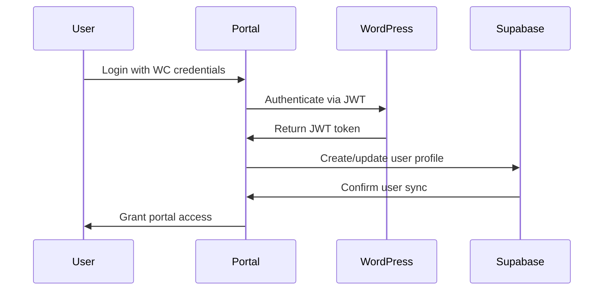

# BDA Portal Architecture & Context

## Project Overview

### Business Requirements
The Business Development Association (BDA) needs a member portal that integrates with their existing WordPress/WooCommerce system to manage:
- Professional certifications (CP™, SCP™)
- Professional Development Credits (PDCs)
- Partner management (PDP Partners)
- Exam vouchers and curriculum access
- Certificate verification system

### Key Constraint
**Users already exist in WooCommerce** - they register and purchase on the WC site first, then access the portal with the same credentials.

## Current Infrastructure

### WordPress/WooCommerce Setup
- **Hosting**: Hostinger shared hosting
- **Purpose**: Main website + e-commerce store
- **User Base**: Existing customers with WC accounts
- **Products**: Exam vouchers, curriculum, digital books
- **Payment Processing**: Standard WooCommerce checkout

### Existing User Journey
1. User discovers BDA through main WordPress site
2. User registers account on WooCommerce
3. User purchases exam voucher/curriculum through WC store
4. User should access portal with same credentials
5. Portal provides certification management, PDCs, etc.

## Proposed Architecture

### Technology Stack
- **Frontend**: Next.js (static export for shared hosting)
- **Database**: Supabase (portal-specific data + sync)
- **Authentication**: WordPress JWT + Supabase integration
- **Hosting**: Hostinger shared hosting (static files)
- **Integration**: WordPress REST API + WooCommerce API

### System Components

```
┌─────────────────┐    ┌──────────────────┐    ┌─────────────────┐
│   WordPress     │    │    Next.js       │    │    Supabase     │
│   WooCommerce   │◄──►│    Portal        │◄──►│    Database     │
│   (Hostinger)   │    │  (Static Files)  │    │   (Cloud)       │
└─────────────────┘    └──────────────────┘    └─────────────────┘
```

## Authentication Strategy

### Single Sign-On Flow
1. **WordPress as Master**: All users originate from WooCommerce
2. **JWT Authentication**: Portal validates against WordPress using JWT
3. **Supabase Sync**: Create/update Supabase user after WordPress validation
4. **Unified Experience**: Same credentials work everywhere

### Implementation Approach


## Data Architecture

### Data Ownership
- **WordPress**: Master user data, orders, products
- **Supabase**: Portal features, PDCs, certificates, partner data
- **Sync Strategy**: WordPress → Supabase (one-way primary)

### Key Entities
```sql
-- Supabase Tables (Example)
users (
  id UUID PRIMARY KEY,
  wp_user_id INTEGER UNIQUE,
  email TEXT,
  wp_sync_status JSONB,
  created_at TIMESTAMP
)

certifications (
  id UUID PRIMARY KEY,
  user_id UUID REFERENCES users(id),
  type TEXT, -- 'CP' or 'SCP'
  credential_id TEXT UNIQUE,
  issued_date DATE,
  expiry_date DATE,
  status TEXT
)

pdcs (
  id UUID PRIMARY KEY,
  user_id UUID REFERENCES users(id),
  program_id TEXT,
  hours INTEGER,
  evidence_url TEXT,
  status TEXT,
  submitted_date TIMESTAMP
)

pdp_partners (
  id UUID PRIMARY KEY,
  name TEXT,
  status TEXT,
  approval_date DATE
)

pdp_programs (
  id UUID PRIMARY KEY,
  partner_id UUID REFERENCES pdp_partners(id),
  program_id TEXT UNIQUE,
  title TEXT,
  hours INTEGER,
  expiry_date DATE
)
```

## Integration Points

### WordPress/WooCommerce APIs
- **JWT Authentication**: `/wp-json/jwt-auth/v1/token`
- **User Data**: `/wp-json/wp/v2/users/me`
- **Orders**: `/wp-json/wc/v3/orders`
- **Products**: `/wp-json/wc/v3/products`
- **Webhooks**: Order completion, user updates

### Supabase Integration
- **Authentication**: Sync with WordPress JWT
- **Real-time**: Live updates for portal features
- **Storage**: Certificate files, evidence uploads
- **Row Level Security**: User can only access own data

## Security Considerations

### Authentication Security
- **JWT Token Storage**: HttpOnly cookies or secure storage
- **Token Expiry**: Short-lived tokens (30 minutes)
- **Refresh Mechanism**: Automatic token renewal
- **CORS Configuration**: Restrict to portal domain

### Data Security
- **API Key Management**: Environment variables only
- **HTTPS Enforcement**: All communications encrypted
- **Input Validation**: Sanitize all user inputs
- **Rate Limiting**: Prevent API abuse

### Supabase Security
- **Row Level Security**: Database-level access control
- **API Policies**: Restrict data access by user
- **Audit Logging**: Track all database changes

## Deployment Strategy

### Static Hosting on Hostinger
- **Build Process**: `next build && next export`
- **File Upload**: Static files to shared hosting
- **Environment Variables**: Build-time configuration
- **Updates**: Manual deployment process

### Development Workflow
1. **Local Development**: Full Next.js development server
2. **API Testing**: Against WordPress staging/production
3. **Build & Export**: Generate static files
4. **Upload**: Deploy to Hostinger via FTP/file manager

## Portal Features Mapping

### User Dashboard
- **Data Sources**: WordPress (user info) + Supabase (portal stats)
- **Real-time Updates**: Supabase subscriptions
- **Notifications**: Certification expiry, PDC deadlines

### Certification Management
- **Exam Vouchers**: WooCommerce orders
- **Certificates**: Generated and stored in Supabase
- **Verification**: Public verification via credential ID

### PDC System
- **Program Validation**: Against approved PDP programs
- **Evidence Storage**: Supabase storage buckets
- **Progress Tracking**: Real-time PDC accumulation

### Partner Portal
- **Access Control**: Role-based permissions
- **Program Submission**: PDP partners can submit programs
- **Approval Workflow**: Admin approval process

## Performance Considerations

### Caching Strategy
- **Static Assets**: Served directly from hosting
- **API Responses**: Client-side caching with SWR
- **Database Queries**: Supabase query optimization
- **Images**: Optimized and compressed

### Optimization
- **Code Splitting**: Automatic with Next.js
- **Bundle Size**: Tree shaking and optimization
- **Loading States**: Skeleton screens and spinners
- **Error Boundaries**: Graceful error handling

## Monitoring & Maintenance

### Health Checks
- **API Connectivity**: WordPress API status
- **Database Health**: Supabase connection monitoring
- **Sync Status**: WordPress ↔ Supabase sync health

### Logging
- **User Actions**: Authentication, data access
- **API Calls**: Rate limiting and error tracking
- **Sync Operations**: Success/failure logging

## Migration Strategy

### Phase 1: Core Portal
- Authentication system
- Basic dashboard
- User profile management

### Phase 2: Certification Features
- Exam voucher integration
- Certificate generation
- Verification system

### Phase 3: PDC System
- PDC tracking
- Partner program management
- Evidence upload

### Phase 4: Advanced Features
- Real-time notifications
- Analytics dashboard
- Mobile optimization

## Risk Assessment

### Technical Risks
- **WordPress API Changes**: Version compatibility
- **Hostinger Limitations**: Shared hosting constraints
- **CORS Issues**: Cross-origin configuration
- **Data Sync Failures**: WordPress ↔ Supabase sync

### Mitigation Strategies
- **API Versioning**: Use stable WordPress API versions
- **Fallback Mechanisms**: Graceful degradation
- **Error Handling**: Comprehensive error boundaries
- **Backup Systems**: Data backup and recovery

## Success Metrics

### User Experience
- **Login Success Rate**: >99% authentication success
- **Page Load Times**: <3 seconds for portal pages
- **Error Rates**: <1% API call failures
- **User Satisfaction**: Positive feedback on portal UX

### System Performance
- **API Response Times**: <500ms average
- **Database Query Performance**: Optimized queries
- **Sync Accuracy**: 100% data consistency
- **Uptime**: >99.9% portal availability

---

## Next Steps

1. **WordPress JWT Setup**: Install and configure JWT plugin
2. **Supabase Project**: Create database schema and RLS policies
3. **Next.js Boilerplate**: Set up authentication and basic routing
4. **API Integration**: Connect WordPress and Supabase APIs
5. **Core Features**: Implement dashboard and user management
6. **Testing**: Comprehensive testing across all integrations
7. **Deployment**: Static build and hosting setup

---

*This document serves as the foundation for BDA Portal development. All architectural decisions should reference this context to ensure consistency with business requirements and technical constraints.*
